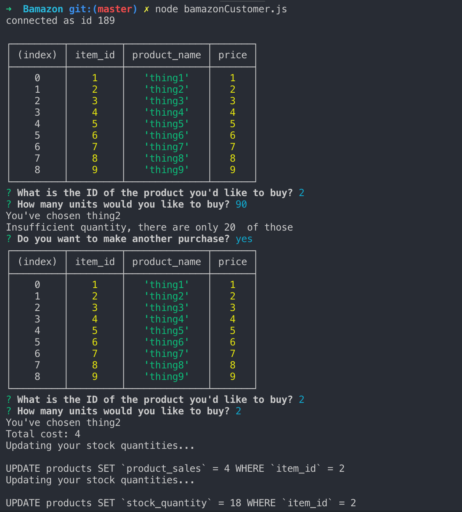
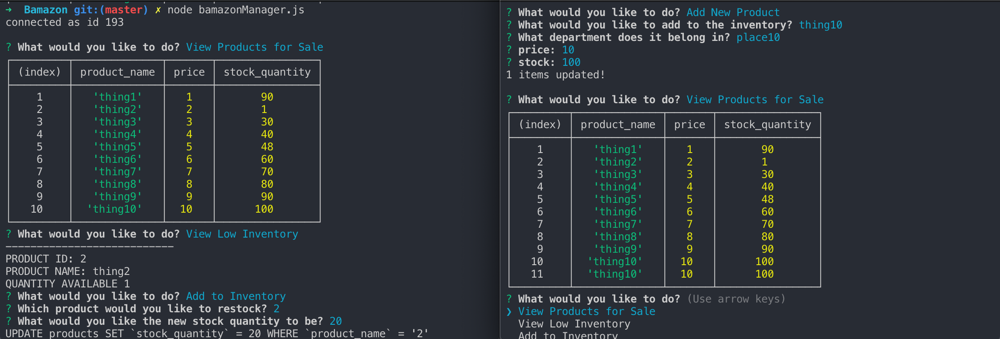
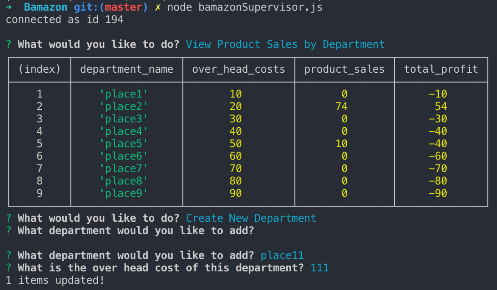

# Bamazon

### University of Texas at Austin Coding Bootcamp: Homework 9

This program is an Amazon like store-front created using MySQL and JavaScript. The app takes in orders from customers and depletes stock from the store's inventory. It also tracks product sales across the store's departments and provides a summary of the highest-grossing departments in the store.

---

The first file in this repository, *bamazonCustomer.js*, allows the user to purchase items. The user is prompted to select an item to purchase by item ID. Then, the user must specify how many units of said item they'd like to purchase. If they try to buy more units than the store has, the console will show a message saying "Insufficient quantity, there are only X of those".

Below is an example of the customer side of the application: 

--- 

The second file in this repository, *bamazonManager.js*, allows the user to access information about the store's products, as well as replenish items. When the application starts, the user is given a menu with five options: "View Products for Sale", "View Low Inventory", "Add to Inventory", "Add New Product", "EXIT". 

Below is an example of the manager side of the application: 

---

The third file in this repository, *bamazonSupervisor.js*, allows the user to access information about the store's departments and sales records. When the application starts, the user is given a menu with three options: "View Product Sales by Department", "Create New Department", "Exit". 

Below is an example of the supervisor side of the application: 

